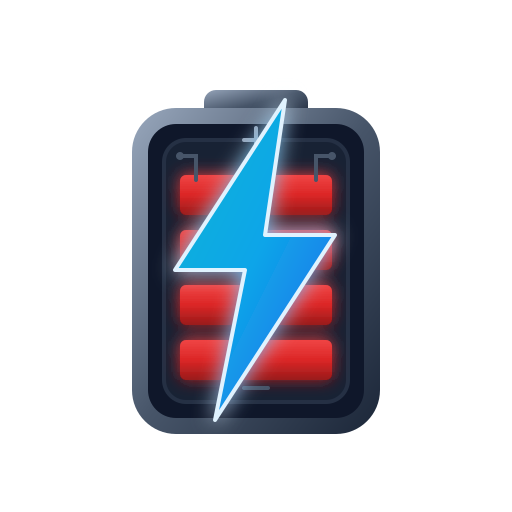

<p align="center">
  
</p>

# SalEdge

A production-grade, multi-user ERP and shop management system custom-built for modern battery retailers. It combines multi-firm billing, strict Indian GST compliance, native desktop packaging via Tauri, a secure QR-paired Mobile Companion, and an advanced local AI Semantic Layer powered by Ollama/Gemini.

---

## Table of Contents

- [Core Modules & Features](#core-modules--features)
  - [Point of Sale (POS) & Billing](#point-of-sale-pos--billing)
  - [Indian GST Compliance](#indian-gst-compliance)
  - [E-Invoice & E-Way Bill Integration](#e-invoice--e-way-bill-integration)
  - [AI Business Assistant & Insights](#ai-business-assistant--insights)
  - [AI-Powered Purchase Invoice OCR](#ai-powered-purchase-invoice-ocr)
  - [Mobile Companion App](#mobile-companion-app)
  - [Inventory, Serial, and Barcode Tracking](#inventory-serial-and-barcode-tracking)
  - [Warranty, RMA & Charging Services](#warranty-rma--charging-services)
  - [Accounting, Banking & Closures](#accounting-banking--closures)
  - [Security, Roles & Multi-User Concurrency](#security-roles--multi-user-concurrency)
- [Architecture Blueprint](#architecture-blueprint)
- [Prerequisites & System Requirements](#prerequisites--system-requirements)
- [Quick Start](#quick-start)
- [AI Assistant & Semantic Layer Setup](#ai-assistant--semantic-layer-setup)
- [Mobile Companion Pairing](#mobile-companion-pairing)
- [Desktop Distribution (Tauri)](#desktop-distribution-tauri)
- [Environment Variables](#environment-variables)
- [Production Deployment](#production-deployment)

---

## Core Modules & Features

### Point of Sale (POS) & Billing
* **Multi-Firm Billing:** Issue invoices from multiple legal entities (different GSTINs, addresses, terms) while referencing a unified, shared inventory.
* **Flexible Invoicing:** Supports B2B (with buyer GSTIN validation) and B2CS sales, debit notes, credit notes, custom line-item discounts (percentage or flat), and installation/service charges.
* **Drafts & Quotations:** Save transactions as drafts or issue formal quotations before finalizing payment.
* **Invoice Receipts:** Generate high-quality printable PDFs or receipt formats with integrated terms, payment status, and firm details.

### Indian GST Compliance
* **GSTR-1 Ready Exports:** Automatically compile and export GSTR-1 reports, partitioned into standard **B2B**, **B2CS**, and **HSN-wise summary** CSV formats for easy filing.
* **GSTR-3B Computation:** Generate periodic summaries auto-calculating total liability, claimable Input Tax Credit (ITC), and net payable taxes across CGST, SGST, and IGST. ITC uses the per-item tax captured on each purchase bill instead of a single back-calculated rate.
* **Per-Line HSN Rates:** Cart lines carry their own statutory rate from the product's HSN code (lead-acid 28%, lithium 18%, solar 12%…), so mixed-rate invoices are taxed correctly per bucket; overall discounts are allocated pro-rata.
* **Paise-Exact Reconciliation:** CGST/SGST halves always sum exactly to the filed tax total (SGST carries the odd paisa).
* **Automatic Tax Splitting:** Intelligently splits taxes (CGST + SGST vs. IGST) based on the billing state (Place of Supply) and buyer state code.
* **Tax Regime Support:** Toggle between **Regular** (full tax breakdown) and **Composition** (consolidated tax) schemes.

### E-Invoice & E-Way Bill Integration
* **Explicit Modes:** **Sandbox/Mock** generation produces clearly-marked `MockGenerated` documents (never filed); **Live** mode files real IRNs through your GSP and fails loudly on any error — a failed GSP call never silently degrades to fabricated legal documents.
* **Turnover-Based Applicability:** E-invoicing applies to B2B invoices when the firm's aggregate turnover crosses the statutory mandate (configured in Settings), not per-invoice value.
* **E-Way Bill Integration:** Triggers e-way bill generation for consignments exceeding GST statutory limits (e.g., ₹50,000 threshold) or interstate transport.
* **Status Auditing:** Full capability to cancel generated E-Invoices or E-Way bills directly from the transaction log, with audit trails.

### AI Business Assistant & Insights
* **Local or Cloud AI:** Run fully local using **Ollama** (e.g., Gemma, Llama, Phi) or cloud-hosted **Google Gemini** models.
* **RAG-Powered Chat:** Natural language assistant with access to real-time, anonymized business metrics (sales, P&L, aging receivables/payables, inventory health).
* **Intent-Based Action Triggers:** The assistant can translate natural language into application commands, such as:
  * Creating a customer payment voucher or operational expense.
  * Navigating to pages or pulling up receipt PDFs.
  * Executing inventory/warranty lookups or loading specific report filters.
* **Semantic Layer Middleware:** Employs a custom Python service to handle **semantic caching** (hits return in `<15ms`), **intent-based query routing**, and **RAG context compression** (token savings).

### AI-Powered Purchase Invoice OCR
* **Automated Purchase Entry:** Upload supplier invoice images or PDF documents via desktop or mobile.
* **Vision extraction:** Local vision models (or Gemini) parse supplier name, invoice date, GSTIN, HSN codes, batch details, unit prices, quantities, and MRPs.
* **Draft Pre-population:** Instantly pre-populate purchase items, reducing manual input to simple confirmation and serial number assignment.

### Mobile Companion App
* **Web-Based Companion:** Connect multiple smartphones or tablets to the primary workstation by simply scanning a QR code (no native app install required).
* **Local HTTPS Pairing:** Automatically generates local self-signed SSL certificates so standard mobile cameras can scan and connect securely.
* **On-the-Go Scanners:** Use your phone's camera to scan battery barcodes/serial numbers directly into the active sales screen or inventory audit modal.
* **Mobile Dashboard:** View quick summaries of daily closes, register service jobs, and capture supplier invoice photos directly from the shop floor.

### Inventory, Serial, and Barcode Tracking
* **Serialized Inventory:** Track every single battery by its unique manufacturer serial number, recording exact purchase cost, MRP, supplier, and sale status.
* **Barcode Management:** Assign product-level SKU barcodes. Use native camera or USB hardware scanners to execute sales billing, purchase entries, and stocktakes.
* **Low Stock Alerts:** Set custom threshold levels per product type with real-time sidebar and header notifications.
* **Technical Attributes:** Track battery-specific attributes including Brand, Technology (Tubular, Flat Plate, SMF, Gel, Lithium), Capacity (Ah), Voltage, and Solar C-Rating (C10, C20, C5).

### Warranty, RMA & Charging Services
* **Split Warranty Logic:** Separates Free Replacement Guarantee from Pro-rata Warranty periods, auto-calculating precise expiration dates.
* **Warranty Lookup:** Find battery purchase dates, remaining warranty, and customer details instantly by scanning or entering a serial number.
* **RMA Claims Tracking:** Log manufacturer warranty claims, track sent/received dates, record ticket numbers, and print warranty replacement documents.
* **Charging & Loaner Services:** Manage customer charging service jobs, set priorities, and track standby/loaner batteries loaned to customers (preventing inventory shrinkage).

### Accounting, Banking & Closures
* **Ledger Banking:** Create multiple bank ledgers (Cash, Current Account, Savings, UPI Gateway) and track deposits, withdrawals, and inter-account transfers (Contra).
* **Receipt & Payment Vouchers:** Record payments to suppliers (debited from bank/cash accounts) or receipts from customers (reducing accounts receivable).
* **Expense Logging:** Track operational expenses (Rent, Salaries, Utilities, Supplies) to keep accurate P&L statements.
* **Periodic Closures:**
  * **Daily Close:** Reconcile cash/card/UPI balances against expected drawer totals. Logs discrepancies and locks daily books.
  * **Monthly/Yearly Close:** Finalize monthly/yearly ledgers to prevent retrospective adjustments and calculate true net profit.

### Security, Roles & Multi-User Concurrency
* **Role-Based Access Control:** Separate accounts for **Admins** (user management, billing configuration, database actions) and **Staff** (sales, services, inventory entries).
* **Forced Password Rotation:** Seeded and admin-assigned passwords must be changed on first login before the app can be used.
* **Hardened Auth:** Passwords hashed with scrypt (legacy bcrypt hashes upgrade transparently on login), login/register endpoints rate-limited, CORS pinned to localhost + `ALLOWED_ORIGINS`, strict security headers (CSP, nosniff, DENY framing).
* **Server-Side Secrets:** Gemini and GSP API keys are stored server-side (`data/` SQLite `_secrets` store, admin-only) and never shipped to browsers; live e-invoicing is proxied through the app's own server.
* **Session Guard:** Automatic logout and lock-screen engagement after 30 minutes of inactivity.
* **Optimistic Concurrency Control:** Every write carries the collection version it was read at; the API rejects stale or version-less overwrites with a `409` status code, prompting staff to refresh before saving.
* **Immutable Audit Trails:** Deletions, imports/resets, backups and e-invoice actions are written to a server-side **append-only** audit table enforced by database triggers (UPDATE/DELETE are aborted). The trail survives app resets.
* **Backups:** On-demand server-side SQLite backups (Settings ➔ Data & Backups, newest 10 kept in `data/backups/`), an automatic snapshot before every import/reset, and a final backup on production shutdown.

---

## Architecture Blueprint

```
┌────────────────────────────────────────────────────────┐
│                   Mobile Companion                     │
│   (Phone Browser / Camera / Barcode & OCR Uploads)      │
└──────────────────────────┬─────────────────────────────┘
                           │ HTTPS (local, QR-paired)
                           ▼
┌────────────────────────────────────────────────────────┐
│                   Vite/React UI                        │
│    (Dashboard, Forms, Recharts, POS, GST Reports)      │
└──────────────────────────┬─────────────────────────────┘
                           │ IPC (Tauri Desktop) or API Requests
                           ▼
┌────────────────────────────────────────────────────────┐
│                   Express API Server                   │
│ (JWT Auth + Rate Limiting, GST Engine, E-Invoice GSP   │
│  Proxy, Append-Only Audit Log, SQLite Backups)         │
└────────────────────┬───────────────┬───────────────────┘
                     │               │
     SQLite DB       │               │ HTTP (port 8090)
     (better-sqlite3)▼               ▼
┌────────────────────────┐   ┌───────────────────────────┐
│       bsms.sqlite      │   │   Python Semantic Layer   │
│ (Shared Store, Audit)  │   │  (FAISS Cache, RAG Comp,  │
└────────────────────────┘   │   Intent Routing, Ollama) │
                             └───────────────┬───────────┘
                                             │ Local API
                                             ▼
                                     ┌───────────────┐
                                     │ Local Ollama  │
                                     └───────────────┘
```

---

## Prerequisites & System Requirements

To run BSMS locally or package it for distribution, you need:
- **Node.js:** v18 or later (v20+ recommended)
- **Rust Toolchain:** (Only required for packaging Tauri desktop builds) - [Rustup Installer](https://rustup.rs/)
- **Python:** v3.9 or later (Only required for the AI Semantic Caching Layer)
- **Ollama:** (Optional, for local AI) - [Ollama website](https://ollama.com/)

---

## Quick Start

1. **Install Dependencies:**
   ```bash
   npm install
   ```

2. **Initialize local environment variables:**
   ```bash
   cp .env.example .env
   ```

3. **Start the Development Stack:**
   ```bash
   npm run dev
   ```
   *This automatically starts the Express server, Vite dev server, and triggers python semantic layer setup.*

4. **Access the application:**
   - **Desktop UI:** `https://localhost:3000` (or next free port)
   - **Backend API:** `http://localhost:3001`
   - **Default Credentials:**
     * **Admin User:** Username: `admin` | Password: `admin123`
     * **Staff User:** Username: `staff` | Password: `staff123`

---

## AI Assistant & Semantic Layer Setup

The application features a semantic layer middleware that intercepts text generation queries to speed up execution and reduce token consumption.

### Setup Steps
1. Make sure you have Ollama running:
   ```bash
   ollama serve
   ```
2. Pull your chosen models. By default, the application will auto-discover installed models:
   ```bash
   # Recommendation for vision-based OCR:
   ollama pull llama3.2-vision
   # Recommendation for chat & insights:
   ollama pull llama3.2:3b
   ```
3. Enable Ollama in **Settings ➔ AI Assistant**.
4. The semantic layer will boot automatically with `npm run dev`. To set it up manually or run benchmarks:
   ```bash
   # One-time manual setup
   npm run semantic:setup

   # Start semantic layer stand-alone (default port 8090)
   npm run semantic:serve

   # Run performance benchmarks
   npm run semantic:benchmark
   ```

---

## Mobile Companion Pairing

To connect a mobile phone or tablet:
1. Navigate to **Mobile Companion** (or **Settings ➔ Mobile Companion**) on the main desktop interface.
2. Ensure both the desktop workstation and mobile device are on the **same Wi-Fi network**.
3. Scan the generated QR code using your phone's native camera.
4. **Safari / Chrome Certificate Warning:** The QR code routes to an HTTPS endpoint using a local self-signed certificate (critical for secure camera access). Accept the browser certificate exception on the first visit.

---

## Desktop Distribution (Tauri)

BSMS can run as a standalone desktop executable (macOS `.app`, Windows `.exe`, or Linux `.AppImage`). Tauri packages the React assets and launches the Express + SQLite backend locally as a background sidecar process.

```bash
# Run desktop development window
npm run tauri:dev

# Compile release installer
npm run tauri:build
```
*Note: Compiled executables store SQLite files inside the standard system-specific App Data directory.*

---

## Environment Variables

Configure application parameters using a `.env` file in the root directory:

| Variable | Default | Description |
| :--- | :--- | :--- |
| `PORT` | `auto` | Express API port. If `auto`, it will bind to the first free port starting from 3001. |
| `DATABASE_PATH` | `data/bsms.sqlite` | Absolute or relative path to the SQLite DB file. |
| `JWT_SECRET` | *(dev fallback)* | JWT signing key. **Required in production — the server refuses to boot without it.** Generate with `openssl rand -hex 32`. |
| `ALLOWED_ORIGINS` | *(localhost only)* | Comma-separated extra origins accepted by CORS (e.g., a LAN dev front-end). |
| `ALLOW_REGISTRATION` | `false` | Enables self-registration UI on the lock screen. |
| `SEMANTIC_LAYER_ENABLED` | `true` | Route assistant questions through the Python Semantic Layer. |
| `SEMANTIC_LAYER_AUTO_START`| `true` | Starts the semantic layer server automatically during main app startup. |
| `SEMANTIC_LAYER_URL` | `auto` | Endpoint for the semantic layer API. If `auto` or unset, the launcher binds a free local port instead of the default 8090. |
| `SEMANTIC_VECTOR_BACKEND` | `faiss` | Semantic-cache vector index: `faiss` or `chroma` (falls back to FAISS if ChromaDB isn't installed). |
| `SEMANTIC_TIER_SMALL_MODEL` / `_MEDIUM_` / `_LARGE_` | *(auto-discovered)* | Pin per-tier Ollama models for the semantic router. Empty/`auto` discovers small/median/largest completion models from installed Ollama models at startup; if discovery fails, tiers stay unassigned and requests fail at inference until configured or Ollama becomes reachable. |
| `OLLAMA_BASE_URL` | `http://127.0.0.1:11434`| Target Ollama instance for direct requests (fallback & OCR). |

---

## Tests

```bash
npm test        # node:test suite: GST math, auth/hashing, rate limiter, DB concurrency + audit triggers, e-invoice integrity
```
The database tests run against an isolated temp SQLite file and never touch `data/`.

---

## Production Deployment

For standard server deployments (non-Tauri):

1. **Build the production client assets:**
   ```bash
   npm run build
   ```
2. **Launch the production node server:**
   ```bash
   # Ensure production variable states are configured in .env
   npm start
   ```
   *The server acts as both the API host and the static file provider, serving the Vite bundle from the `dist/` directory.*
